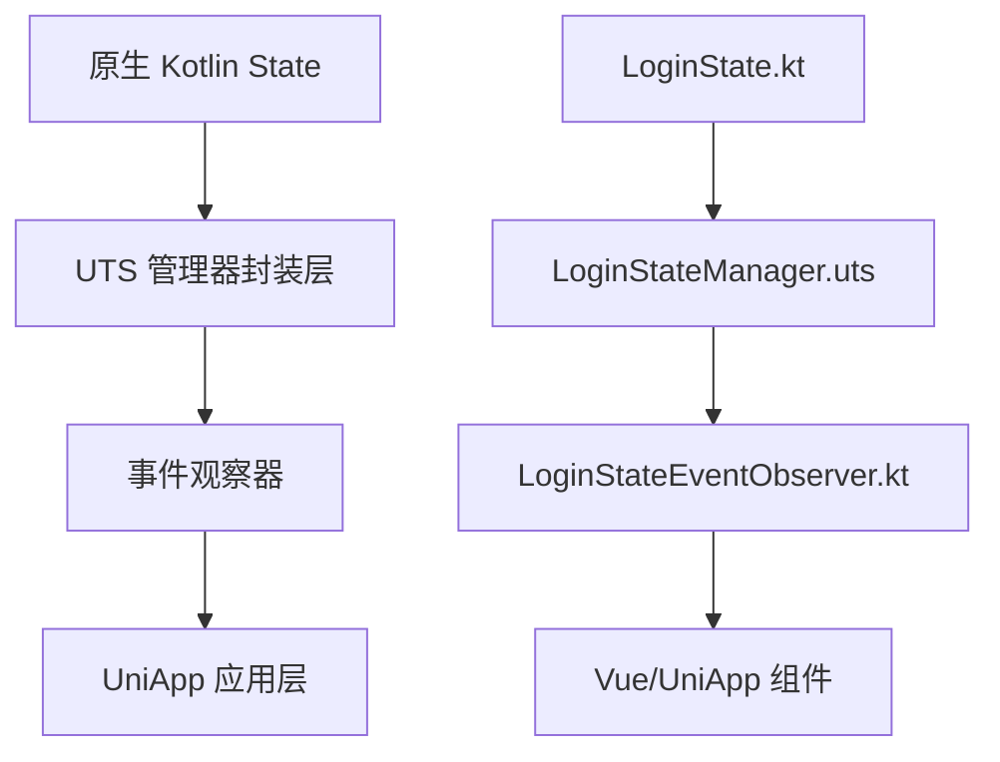

# UTS State 转化规则文档

## 概述

本文档基于 `LoginState.kt` 到 UTS 封装层的转化实践，总结出可复用的转化规则和最佳实践，用于指导其他类似 State 类的转化工作。

## 转化架构分析

### 整体架构设计



### 分层职责

| 层级 | 文件类型 | 主要职责 | 示例 |
|------|----------|----------|------|
| 原生层 | `*.kt` | 核心业务逻辑、状态管理 | `LoginState.kt` |
| UTS封装层 | `*.uts` | 接口适配、参数转换 | `loginState.uts` |
| 事件观察层 | `*EventObserver.kt` | 状态监听、事件分发 | `LoginStateEventObserver.kt` |
| 应用层 | `*.vue` | 界面展示、用户交互 | Vue 组件 |

## 转化规则详解

### 规则一：分层架构模式

#### 文件命名规范
```
原生类：      XxxState.kt
UTS管理器：   XxxStateManager.uts  
事件观察器：  XxxStateEventObserver.kt
接口定义：    interface.uts
```

#### 基础架构模板

**UTS 管理器模板：**
```typescript
// XxxStateManager.uts
import Context from "android.content.Context";
import { XxxOptions, XxxCallback } from '../interface.uts';
import { XxxState } from 'com.your.package.path';

export class XxxStateManager {
    private static _instance : XxxStateManager | null = null;
    private context : Context = UTSAndroid.getAppContext() as Context;
    private xxxState : XxxState

    public static getInstance() : XxxStateManager {
        if (!this._instance) {
            this._instance = new XxxStateManager();
        }
        return this._instance!;
    }

    constructor() {
        this.xxxState = XxxState.getInstance();
        console.log(`${TAG} constructor, this.xxxState: ${this.xxxState}`);
    }
}
```

**事件观察器模板：**
```kotlin
// XxxStateEventObserver.kt
package com.your.package.path

import kotlinx.coroutines.CoroutineScope
import kotlinx.coroutines.Dispatchers
import kotlinx.coroutines.Job
import kotlinx.coroutines.flow.drop
import kotlinx.coroutines.launch

class XxxStateEventObserver {
    fun onXxxChanged(callback: (String) -> Unit) {
        val bindDataJob: Job = CoroutineScope(Dispatchers.Main).launch {
            XxxState.getInstance().xxxFlow.collect {
                console.log("onXxxChanged")
                callback(it.toString())
            }
        }
    }

    companion object {
        val shared by lazy(LazyThreadSafetyMode.SYNCHRONIZED) {
            XxxStateEventObserver()
        }

        @JvmStatic
        fun getInstance(): XxxStateEventObserver = shared
    }
}
```

### 规则二：单例模式转化

#### Kotlin 单例 → TypeScript 单例

**原生层（Kotlin）：**
```kotlin
class LoginState private constructor() {
    companion object {
        val shared by lazy(LazyThreadSafetyMode.SYNCHRONIZED) {
            LoginState()
        }
        
        @JvmStatic
        fun getInstance(): LoginState = shared
    }
}
```

**UTS封装层（TypeScript）：**
```typescript
export class LoginStateManager {
    private static _instance : LoginStateManager | null = null;
    
    public static getInstance() : LoginStateManager {
        if (!this._instance) {
            this._instance = new LoginStateManager();
        }
        return this._instance!;
    }
}
```

### 规则三：方法参数封装模式

#### 多参数 → Options 对象模式

**转化前（原生）：**
```kotlin
fun login(
    context: Context?,
    sdkAppID: Int,
    userID: String?,
    userSig: String?,
    callback: ActionCallback?
)
```

**转化后（UTS）：**
```typescript
// 1. 定义 Options 接口
export type LoginOptions = {
    context?: Context;
    sdkAppID: number;
    userID: string;
    userSig: string;
    success?: () => void;
    fail?: (errCode: number, errMsg: string) => void;
}

// 2. 方法实现
public login(options : LoginOptions) {
    if (options == null) {
        console.log(`${TAG} login, data is empty`);
        return;
    }
    
    console.warn(`${TAG} login, data: ${JSON.stringify(options)}`);
    this.loginState.login(
        options.context,
        options.sdkAppID.toInt(),
        options.userID,
        options.userSig,
        this.createActionCallback(options)
    );
}
```

#### 参数验证模板
```typescript
private validateOptions(options: any, requiredFields: string[]): boolean {
    if (options == null) {
        console.log(`${TAG} options is empty`);
        return false;
    }
    
    for (const field of requiredFields) {
        if (options[field] == null || options[field] === '') {
            console.log(`${TAG} ${field} is required`);
            return false;
        }
    }
    return true;
}
```

### 规则四：回调机制转化

#### ActionCallback 标准转换模板

**原生回调接口：**
```kotlin
interface ActionCallback {
    fun success()
    fun fail(errCode: Int, errMsg: String)
}
```

**UTS 回调封装：**
```typescript
// 1. 定义回调工具方法
private createActionCallback(options: any): ActionCallback {
    return new ActionCallback() {
        success: () => {
            console.log(`${TAG} operation success`);
            options?.success?.();
        },
        fail: (errCode: number, errMsg: string) => {
            console.log(`${TAG} operation failed: ${errCode}, ${errMsg}`);
            options?.fail?.(errCode, errMsg);
        }
    };
}

// 2. 在方法中使用
public someMethod(options: SomeOptions) {
    this.nativeState.someMethod(
        options.param1,
        options.param2,
        this.createActionCallback(options)
    );
}
```

### 规则五：状态监听转化

#### StateFlow → 事件发射机制

**原生层状态定义：**
```kotlin
private val _loginStatus = MutableStateFlow(LoginStatus.LOGGED_OUT)
val loginStatus: StateFlow<LoginStatus> = _loginStatus.asStateFlow()

private val _loginUserInfo = MutableStateFlow(LoginUserInfo())
val loginUserInfo: StateFlow<LoginUserInfo> = _loginUserInfo.asStateFlow()
```

**事件观察器实现：**
```kotlin
fun onLoginStatusChanged(callback: (String) -> Unit) {
    val bindDataJob: Job = CoroutineScope(Dispatchers.Main).launch {
        LoginState.getInstance().loginStatus.collect {
            console.log("onLoginStatusChanged")
            callback(it.toString())
        }
    }
}
```

**UTS层事件导出：**
```typescript
export const onLoginStatusChanged = function (callback : (res : string) => void) {
    LoginStateEventObserver.getInstance().onLoginStatusChanged(function (res : string) {
        console.log(`${TAG} onLoginStatusChanged, res: ${JSON.stringify(res)}`);
        uni.$emit('onLoginStatusChanged', JSON.stringify(res))
    })
}
```

### 规则六：类型转换模式

#### 常见类型转换规则

| Kotlin 类型 | UTS/TypeScript 类型 | 转换方法 | 示例 |
|-------------|---------------------|----------|------|
| `String` | `string` | 直接使用 | `options.userID` |
| `Int` | `number` | `.toInt()` | `options.sdkAppID.toInt()` |
| `Double` | `number` | `.toDouble()` | `options.value.toDouble()` |
| `Boolean` | `boolean` | 直接使用 | `options.enabled` |
| `Object` | `Object` | 构造新实例 | 见下方示例 |

#### 复杂对象转换示例
```typescript
// 原生对象构造
let userInfo : TUIRoomDefine.LoginUserInfo = new TUIRoomDefine.LoginUserInfo()
userInfo.userId = options.userInfo.userId
userInfo.userName = options.userInfo.userName
userInfo.avatarUrl = options.userInfo.avatarUrl
```

### 规则七：接口定义规范

#### Options 接口设计模板 - 正确的做法

⚠️ **重要坑点：UTS 不支持 TypeScript 交叉类型（Intersection Types）**

**❌ 错误做法（使用交叉类型）：**
```typescript
// 这种写法会导致编译错误：Intersection Type is not supported
export type BaseOptions = {
    success?: () => void;
    fail?: (errCode: number, errMsg: string) => void;
}

export type LoginOptions = BaseOptions & {  // ❌ 不支持 & 操作符
    context?: Context;
    sdkAppID: number;
    userID: string;
    userSig: string;
}
```

**✅ 正确做法（使用接口继承）：**
```typescript
// interface.uts
export interface BaseOptions {
    success?: () => void;
    fail?: (errCode: number, errMsg: string) => void;
}

export interface LoginOptions extends BaseOptions {  // ✅ 使用 extends 继承
    context?: Context;
    sdkAppID: number;
    userID: string;
    userSig: string;
}

export interface LogoutOptions extends BaseOptions {
    // 扩展特定参数
}

export interface SetSelfInfoOptions extends BaseOptions {
    userInfo: {
        userId: string;
        userName?: string;
        avatarUrl?: string;
    };
}
```

#### 接口设计最佳实践
```typescript
// 1. 基础接口定义
export interface BaseOptions {
    success?: () => void;
    fail?: (errCode: number, errMsg: string) => void;
}

// 2. 具体业务接口继承
export interface FetchLiveListOptions extends BaseOptions {
    category: number;
    cursor?: string;
    count?: number;
}

export interface CreateLiveOptions extends BaseOptions {
    liveInfo: LiveInfo;
}

// 3. 复杂类型定义
export type LiveInfo = {
    liveId: string;
    liveName?: string;
    liveType?: LiveType;
    liveDescription?: string;
    // ... 其他字段
}
```

## 转化工作流程

### Step 1: 分析原生 State 类

1. **识别关键元素**
   - [ ] 单例模式实现
   - [ ] Public 方法列表
   - [ ] StateFlow 属性
   - [ ] 回调接口类型
   - [ ] 依赖的其他类

2. **分析方法签名**
   ```kotlin
   // 记录每个方法的：
   // - 参数类型和数量
   // - 返回值类型  
   // - 回调机制
   // - 业务含义
   ```

### Step 2: 设计 UTS 封装层

1. **创建管理器类**
   ```typescript
   // 1. 实现单例模式
   // 2. 引入原生State实例
   // 3. 设计Options接口
   // 4. 实现方法封装
   ```

2. **参数验证策略**
   ```typescript
   // 1. 空值检查
   // 2. 必填字段验证
   // 3. 类型转换
   // 4. 错误处理
   ```

### Step 3: 实现事件观察器

1. **创建观察器类**
   ```kotlin
   // 1. 实现单例模式
   // 2. 监听StateFlow
   // 3. 转换事件格式
   // 4. 分发到UTS层
   ```

2. **事件导出函数**
   ```typescript
   // 1. 包装观察器调用
   // 2. 转换为uni.$emit
   // 3. 添加日志记录
   ```

### Step 4: 测试验证

1. **功能测试清单**
   - [ ] 单例模式正常工作
   - [ ] 所有方法可正常调用
   - [ ] 参数验证生效
   - [ ] 回调机制正常
   - [ ] 状态监听正常
   - [ ] 事件发射正常

## 最佳实践建议

### 1. 代码组织
- 保持文件结构清晰，按功能模块组织
- 统一命名规范，便于维护
- 添加详细的注释和日志

### 2. 错误处理
- 实现完整的参数验证
- 提供清晰的错误信息
- 统一错误码规范

### 3. 性能优化
- 避免重复创建回调对象
- 合理管理协程生命周期
- 及时清理资源

### 4. 可维护性
- 使用 TypeScript 类型系统
- 实现接口继承和复用
- 保持版本兼容性

## 常见问题解决

### Q1: 回调函数不执行
**原因：** ActionCallback 实现不正确
**解决：** 检查回调对象的方法名和参数类型

### Q2: 类型转换错误
**原因：** UTS 与 Kotlin 类型不匹配
**解决：** 使用正确的类型转换方法（如 `.toInt()`）

### Q3: 状态监听无响应
**原因：** StateFlow 监听未正确建立
**解决：** 检查协程作用域和生命周期管理

### Q4: 单例实例为空
**原因：** 单例初始化时机不当
**解决：** 确保在正确的时机调用 `getInstance()`

### Q5: 编译报错 "Intersection Type is not supported"
**原因：** 在 UTS 文件中使用了 TypeScript 交叉类型（`&` 操作符）
**解决：** 
```typescript
// ❌ 错误做法
export type MyOptions = BaseOptions & {
    customField: string;
}

// ✅ 正确做法
export interface MyOptions extends BaseOptions {
    customField: string;
}
```

**关键要点：**
- UTS 不支持交叉类型（`&`）语法
- 必须使用接口继承（`extends`）代替
- 将 `type` 改为 `interface` 才能使用继承
- 这是 UTS 与标准 TypeScript 的重要差异

## 总结

通过遵循本文档的转化规则，可以系统化地将原生 Kotlin State 类转换为 UTS 封装层，实现：

- ✅ 统一的接口设计
- ✅ 类型安全的参数传递
- ✅ 可靠的状态监听机制
- ✅ 良好的错误处理
- ✅ 可维护的代码结构

这套规则已在 `LoginState` 和 `LiveState` 转化中验证有效，可直接应用于其他类似的 State 类转化工作。

**特别注意：** 在接口设计时必须避免使用 TypeScript 交叉类型，改用接口继承的方式实现代码复用。 