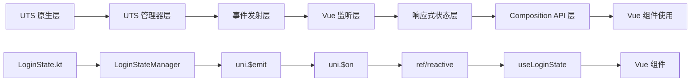

# Vue Composition API 封装规则文档

## 概述

本文档基于 `loginState.ts` 对 `loginState.uts` 的封装实践，总结出从 UTS 层到 Vue 应用层的标准转换规则，用于指导其他类似 State 的 Vue 封装工作。

## 转换架构分析

### 整体数据流



### 分层职责

| 层级 | 文件类型 | 主要职责 | 示例 |
|------|----------|----------|------|
| UTS 管理器层 | `*.uts` | 原生接口封装、事件发射 | `loginState.uts` |
| Vue 封装层 | `*.ts` | 响应式状态管理、事件监听 | `loginState.ts` |
| 应用层 | `*.vue` | 界面展示、用户交互 | Vue 组件 |

## 转换规则详解

### 规则一：事件通信机制

#### UTS 层事件发射
```typescript
// loginState.uts - 事件导出函数
export const onLoginInfoChanged = function (callback : (res : string) => void) {
    LoginStateEventObserver.getInstance().onLoginInfoChanged(function (res : string) {
        console.log(`${TAG} onLoginInfoChanged,res: ${JSON.stringify(res)}`);
        uni.$emit('onLoginInfoChanged', JSON.stringify(res))  // 发射事件
    })
}

export const onLoginStatusChanged = function (callback : (res : string) => void) {
    LoginStateEventObserver.getInstance().onLoginStatusChanged(function (res : string) {
        console.log(`${TAG} onLoginStatusChanged,res: ${JSON.stringify(res)}`);
        uni.$emit('onLoginStatusChanged', JSON.stringify(res))  // 发射事件
    })
}
```

#### Vue 层事件监听
```typescript
// loginState.ts - 事件监听绑定
const onLoginInfoChanged = (res: string) => {
    loginUserInfo.value = JSON.parse(res);  // 解析并更新响应式状态
};

const onLoginStatusChanged = (res: string) => {
    loginState.value = JSON.parse(res);     // 解析并更新响应式状态
};

function bindEvent() {
    uni.$on("onLoginInfoChanged", onLoginInfoChanged);    // 监听事件
    uni.$on("onLoginStatusChanged", onLoginStatusChanged); // 监听事件
}
```

### 规则二：响应式状态管理

#### 状态定义模式
```typescript
// 响应式状态定义
const loginUserInfo = ref<TUILoginUserInfo | null>(null);
const loginState = ref();

// 状态类型定义 (从 interface.uts 导入)
import { TUILoginUserInfo } from "@/uni_modules/tuikit-atomic-x";
```

#### 状态更新模式
```typescript
// 事件回调中更新状态
const onLoginInfoChanged = (res: string) => {
    loginUserInfo.value = JSON.parse(res);  // JSON 字符串 → 对象
};

const onLoginStatusChanged = (res: string) => {
    loginState.value = JSON.parse(res);     // JSON 字符串 → 对象
};
```

### 规则三：管理器实例封装

#### UTS 管理器使用
```typescript
// 导入 UTS 管理器
import { LoginStateManager } from "@/uni_modules/tuikit-atomic-x";

// 创建管理器实例
const loginStateManager = new LoginStateManager()
```

#### 方法封装模式 - 最简化版本
```typescript
// 最简化的方法封装 - 只传业务参数，状态通过事件监听自动更新
function login(options: {
    userID: string;
    userName: string;
    avatarUrl: string;
}) {
    loginStateManager.login(options);
}

function logout() {
    loginStateManager.logout({});
}

function setSelfInfo(options: {
    userName?: string;
    avatarUrl?: string;
    customInfo?: Record<string, any>;
}) {
    const info = {
        userName: options.userName || "",
        avatarUrl: options.avatarUrl || "",
    };
    loginStateManager.setSelfInfo({ userInfo: info });
}
```

### 规则四：Composition API 导出

#### Hook 函数设计
```typescript
export function useLoginState() {
    return {
        // 响应式状态
        loginUserInfo,
        loginState,
        
        // 操作方法 - 最简化调用，状态通过事件更新
        login,
        logout,
        setSelfInfo,
    };
}

// 默认导出 (兼容性)
export default useLoginState;
```

### 规则五：生命周期管理

#### 事件绑定与清理
```typescript
function bindEvent() {
    uni.$on("onLoginInfoChanged", onLoginInfoChanged);
    uni.$on("onLoginStatusChanged", onLoginStatusChanged);
}

function unBindEvent() {
    uni.$off("onLoginInfoChanged", onLoginInfoChanged);
    uni.$off("onLoginStatusChanged", onLoginStatusChanged);
}

// 初始化时绑定事件
bindEvent();
```

### 规则六：数据转换规则

#### JSON 数据处理
```typescript
// UTS 层发射：JSON.stringify(res)
uni.$emit('onLoginInfoChanged', JSON.stringify(res))

// Vue 层接收：JSON.parse(res)
const onLoginInfoChanged = (res: string) => {
    loginUserInfo.value = JSON.parse(res);
};
```

#### 类型安全转换
```typescript
// 定义明确的类型
const loginUserInfo = ref<TUILoginUserInfo | null>(null);

// 参数类型约束
function login(options: {
    userID: string;
    userName: string;
    avatarUrl: string;
}) {
    loginStateManager.login(options);
}
```

### 规则七：分层类型设计规则

#### 架构层次设计原则

⚠️ **重要原则：不同层级使用不同的类型系统**

**分层类型架构：**
```
interface.uts     → 完整的 Options 接口（UTS层使用）
├── 包含 success/fail 回调
├── 完整的业务参数
└── 用于跨平台兼容

xxxstate.ts      → 简化的 Params 类型（Vue层使用）
├── 只包含业务参数
├── 移除回调函数
└── 专为Vue层优化
```

#### UTS层完整接口设计

```typescript
// interface.uts - UTS层使用的完整接口
export interface BaseOptions {
    success?: () => void;
    fail?: (errCode: number, errMsg: string) => void;
}

export interface FetchLiveListOptions extends BaseOptions {
    category: number;
    cursor?: string;
    count?: number;
}

export interface CreateLiveOptions extends BaseOptions {
    liveInfo: LiveInfo;
}
```

#### Vue层简化参数类型

```typescript
// xxxstate.ts - Vue层专用的简化参数类型
// 只包含业务参数，不包含回调函数
type FetchLiveListParams = {
    category: number;
    cursor?: string;
    count?: number;
};

type CreateLiveParams = {
    liveInfo: LiveInfo;
};

type JoinLiveParams = {
    liveId: string;
};

type UpdateLiveInfoParams = {
    liveInfo: LiveInfo;
};
```

#### 类型导入最佳实践

**❌ 错误做法（过度依赖）：**
```typescript
// 导入了不需要的Options接口
import {
    LiveStateManager,
    LiveInfo,
    LocalLiveStatus,
    FetchLiveListOptions,    // ❌ Vue层不需要
    CreateLiveOptions,       // ❌ Vue层不需要
    JoinLiveOptions,         // ❌ Vue层不需要
    // ... 其他Options接口
} from "@/uni_modules/tuikit-atomic-x";

// 使用时类型不匹配
function fetchLiveList(options: FetchLiveListOptions) {  // ❌ 包含了success/fail
    liveStateManager.fetchLiveList(options);
}
```

**✅ 正确做法（最小化依赖）：**
```typescript
// 只导入Vue层实际需要的基础类型
import {
    LiveStateManager,
    LiveInfo,
    LocalLiveStatus
} from "@/uni_modules/tuikit-atomic-x";

// 在Vue层定义专用的简化参数类型
type FetchLiveListParams = {
    category: number;
    cursor?: string;
    count?: number;
};

// 使用简化的参数类型
function fetchLiveList(params: FetchLiveListParams) {
    liveStateManager.fetchLiveList(params);
}
```

#### 方法参数设计模式

**统一的参数对象模式：**
```typescript
// 即使是单个参数，也使用对象形式保持一致性
function cancelSchedule(params: CancelScheduleParams) {
    liveStateManager.cancelSchedule(params);
}

function joinLive(params: JoinLiveParams) {
    liveStateManager.joinLive(params);
}

// 调用时保持一致性
cancelSchedule({ liveId: 'live123' });
joinLive({ liveId: 'live123' });
```

**无参数方法的处理：**
```typescript
// 无参数方法，直接调用
function leaveLive() {
    liveStateManager.leaveLive({});
}

function endLive() {
    liveStateManager.endLive({});
}
```

#### 类型复用策略

**复用基础类型：**
```typescript
// 复用interface.uts中的基础类型
import { LiveInfo, LocalLiveStatus } from "@/uni_modules/tuikit-atomic-x";

// 在Vue层组合出新的类型
type CreateLiveParams = {
    liveInfo: LiveInfo;
};

type ScheduleLiveParams = {
    liveInfo: LiveInfo;
};

type UpdateLiveInfoParams = {
    liveInfo: LiveInfo;
};
```

**避免类型冲突：**
```typescript
// 使用不同的命名区分层次
// UTS层：    XxxOptions (包含回调)
// Vue层：    XxxParams  (只包含业务参数)

// UTS层
interface CreateLiveOptions extends BaseOptions {
    liveInfo: LiveInfo;
}

// Vue层
type CreateLiveParams = {
    liveInfo: LiveInfo;
};
```

## 标准封装模板

### UTS State 封装模板

```typescript
// xxxstate.ts
import { ref } from "vue";
import { 
    XxxStateManager,
    XxxDataType,
    XxxStatusType
} from "@/uni_modules/tuikit-atomic-x";

// Vue层专用的简化参数类型
type FetchXxxListParams = {
    category: number;
    cursor?: string;
    count?: number;
};

type CreateXxxParams = {
    xxxInfo: XxxDataType;
};

type JoinXxxParams = {
    xxxId: string;
};

// 1. 响应式状态定义
const xxxList = ref<XxxDataType[]>([]);
const currentXxx = ref<XxxDataType | null>(null);
const xxxStatus = ref<XxxStatusType>('IDLE');

// 2. 管理器实例
const xxxStateManager = XxxStateManager.getInstance();

// 3. 方法封装 - 最简化版本，使用简化参数类型
function fetchXxxList(params: FetchXxxListParams) {
    xxxStateManager.fetchXxxList(params);
}

function createXxx(params: CreateXxxParams) {
    xxxStateManager.createXxx(params);
}

function joinXxx(params: JoinXxxParams) {
    xxxStateManager.joinXxx(params);
}

function leaveXxx() {
    xxxStateManager.leaveXxx({});
}

// 4. 事件监听
const onXxxListChanged = (res: string) => {
    try {
        const data = JSON.parse(res);
        xxxList.value = data.xxxList || [];
    } catch (error) {
        console.error('onXxxListChanged JSON parse error:', error);
    }
};

// 5. 事件绑定
function bindEvent() {
    uni.$on("onXxxListChanged", onXxxListChanged);
}

function unBindEvent() {
    uni.$off("onXxxListChanged", onXxxListChanged);
}

// 6. Composition API 导出
export function useXxxState() {
    return {
        // 响应式状态
        xxxList,
        currentXxx,
        xxxStatus,
        
        // 操作方法 - 最简化调用，状态通过事件更新
        fetchXxxList,
        createXxx,
        joinXxx,
        leaveXxx,
        
        // 事件管理
        bindEvent,
        unBindEvent,
    };
}

// 7. 初始化
bindEvent();

export default useXxxState;
```

### LiveState 封装示例

基于模板，`LiveState` 的封装应该是：

```typescript
// liveListState.ts
import { ref } from "vue";
import { 
    LiveStateManager,
    LiveInfo,
    LocalLiveStatus
} from "@/uni_modules/tuikit-atomic-x";

// Vue层专用的简化参数类型 - 只包含业务参数
type FetchLiveListParams = {
    category: number;
    cursor?: string;
    count?: number;
};

type ScheduleLiveParams = {
    liveInfo: LiveInfo;
};

type CancelScheduleParams = {
    liveId: string;
};

type CreateLiveParams = {
    liveInfo: LiveInfo;
};

type JoinLiveParams = {
    liveId: string;
};

type UpdateLiveInfoParams = {
    liveInfo: LiveInfo;
};

// 响应式状态
const liveList = ref<LiveInfo[]>([]);
const currentLive = ref<LiveInfo | null>(null);
const localLiveStatus = ref<LocalLiveStatus>('IDLE');
const liveListCursor = ref<string>('');

// 管理器实例
const liveStateManager = LiveStateManager.getInstance();

// 方法封装 - 最简化版本，使用简化参数类型
function fetchLiveList(params: FetchLiveListParams) {
    liveStateManager.fetchLiveList(params);
}

function schedule(params: ScheduleLiveParams) {
    liveStateManager.schedule(params);
}

function cancelSchedule(params: CancelScheduleParams) {
    liveStateManager.cancelSchedule(params);
}

function createLive(params: CreateLiveParams) {
    liveStateManager.createLive(params);
}

function joinLive(params: JoinLiveParams) {
    liveStateManager.joinLive(params);
}

function leaveLive() {
    liveStateManager.leaveLive({});
}

function endLive() {
    liveStateManager.endLive({});
}

function updateLiveInfo(params: UpdateLiveInfoParams) {
    liveStateManager.updateLiveInfo(params);
}

// 事件监听
const onLiveListChanged = (res: string) => {
    try {
        const data = JSON.parse(res);
        liveList.value = data.liveList || [];
    } catch (error) {
        console.error('onLiveListChanged JSON parse error:', error);
    }
};

const onCurrentLiveChanged = (res: string) => {
    try {
        const data = JSON.parse(res);
        currentLive.value = data.currentLive || null;
    } catch (error) {
        console.error('onCurrentLiveChanged JSON parse error:', error);
    }
};

const onLocalLiveStatusChanged = (res: string) => {
    try {
        const data = JSON.parse(res);
        localLiveStatus.value = data.localLiveStatus || 'IDLE';
    } catch (error) {
        console.error('onLocalLiveStatusChanged JSON parse error:', error);
    }
};

const onLiveListCursorChanged = (res: string) => {
    try {
        const data = JSON.parse(res);
        liveListCursor.value = data.cursor || '';
    } catch (error) {
        console.error('onLiveListCursorChanged JSON parse error:', error);
    }
};

// 事件绑定
function bindEvent() {
    uni.$on("onLiveListChanged", onLiveListChanged);
    uni.$on("onCurrentLiveChanged", onCurrentLiveChanged);
    uni.$on("onLocalLiveStatusChanged", onLocalLiveStatusChanged);
    uni.$on("onLiveListCursorChanged", onLiveListCursorChanged);
}

function unBindEvent() {
    uni.$off("onLiveListChanged", onLiveListChanged);
    uni.$off("onCurrentLiveChanged", onCurrentLiveChanged);
    uni.$off("onLocalLiveStatusChanged", onLocalLiveStatusChanged);
    uni.$off("onLiveListCursorChanged", onLiveListCursorChanged);
}

// Composition API 导出
export function useLiveListState() {
    return {
        // 状态
        liveList,
        currentLive,
        localLiveStatus,
        liveListCursor,
        
        // 方法 - 最简化调用，状态通过事件更新
        fetchLiveList,
        schedule,
        cancelSchedule,
        createLive,
        joinLive,
        leaveLive,
        endLive,
        updateLiveInfo,
        
        // 事件管理
        bindEvent,
        unBindEvent,
    };
}

// 初始化
bindEvent();

export default useLiveListState;
```

## 转换工作流程

### Step 1: 分析 UTS 层接口

1. **识别导出的管理器类**
   - [ ] 管理器类名和导入路径
   - [ ] 可用的公共方法
   - [ ] 方法参数类型

2. **识别事件监听函数**
   - [ ] 事件名称列表
   - [ ] 事件数据结构
   - [ ] 事件触发时机

### Step 2: 设计响应式状态

1. **状态变量定义**
   ```typescript
   // 根据事件数据设计状态
   const xxxData = ref<XxxType | null>(null);
   const xxxStatus = ref<XxxStatusType>();
   ```

2. **类型导入策略**
   ```typescript
   // 最小化依赖，只导入基础类型
   import { XxxStateManager, XxxDataType, XxxStatusType } from "@/uni_modules/tuikit-atomic-x";
   ```

### Step 3: 设计简化参数类型

1. **提取业务参数**
   ```typescript
   // 从UTS层的完整Options中提取业务参数
   type FetchXxxListParams = {
       category: number;
       cursor?: string;
       count?: number;
   };
   ```

2. **统一命名规范**
   ```typescript
   // UTS层：XxxOptions（包含回调）
   // Vue层：XxxParams（只包含业务参数）
   ```

### Step 4: 实现方法封装

1. **最简化的调用模式**
   ```typescript
   // 使用简化参数类型
   function xxxAction(params: XxxParams) {
       xxxStateManager.xxxAction(params);
   }
   ```

2. **保持方法签名一致性**
   ```typescript
   // 即使单个参数也使用对象形式
   function joinXxx(params: JoinXxxParams) {
       xxxStateManager.joinXxx(params);
   }
   ```

### Step 5: 配置事件监听

1. **事件回调函数**
   ```typescript
   const onXxxChanged = (res: string) => {
       const data = JSON.parse(res);
       xxxState.value = data.xxx;
   };
   ```

2. **事件绑定管理**
   ```typescript
   function bindEvent() {
       uni.$on("onXxxChanged", onXxxChanged);
   }
   
   function unBindEvent() {
       uni.$off("onXxxChanged", onXxxChanged);
   }
   ```

### Step 6: 导出 Composition API

```typescript
export function useXxxState() {
    return {
        // 响应式状态
        xxxData,
        xxxStatus,
        
        // 操作方法 - 最简化调用，状态通过事件更新
        xxxAction,
    };
}
```

## 最佳实践建议

### 1. 状态管理
- 使用 `ref` 或 `reactive` 管理状态
- 明确状态的类型定义
- 合理的初始值设置

### 2. 分层类型设计
- UTS层使用完整的Options接口（包含回调）
- Vue层使用简化的Params类型（只包含业务参数）
- 避免不必要的类型依赖和导入

### 3. 方法调用
- 采用最简化调用模式，只传业务参数
- 状态变化完全通过事件监听自动处理
- UTS 层内部处理成功失败逻辑，Vue 层无需关心

### 4. 参数设计
- 保持方法签名一致性，统一使用对象参数
- 使用描述性的参数类型命名
- 区分不同层次的参数类型（Options vs Params）

### 5. 事件处理
- 及时解绑事件避免内存泄漏
- JSON 数据的安全解析
- 错误处理和容错机制

### 6. 类型安全
- 充分利用 TypeScript 类型系统
- 导入并使用 UTS 层定义的类型
- 避免 any 类型的滥用

### 7. 代码组织
- 清晰的代码结构和注释
- 统一的命名规范
- 合理的函数拆分

## 使用示例

### 在 Vue 组件中使用

```vue
<template>
  <div>
    <div v-if="loginUserInfo">
      欢迎, {{ loginUserInfo.nickname }}
    </div>
    <button @click="handleLogin">登录</button>
    <button @click="handleLogout">登出</button>
  </div>
</template>

<script setup>
import { useLoginState } from '@/uni_modules/tuikit-atomic-x/state/loginState'

const { 
    loginUserInfo, 
    loginState, 
    login, 
    logout 
} = useLoginState()

// 最简化的方法调用 - 只传业务参数
const handleLogin = () => {
    login({
        userID: 'user123',
        userName: '测试用户',
        avatarUrl: 'https://example.com/avatar.jpg'
    })
    // 状态变化会通过事件监听自动更新 loginUserInfo
}

const handleLogout = () => {
    logout()
    // 状态变化会通过事件监听自动更新 loginState
}
</script>
```

## 总结

Vue Composition API 封装规则提供了从 UTS 层到 Vue 应用层的标准化转换方案：

- 🔄 **响应式状态管理** - ref/reactive 管理状态变化
- 📡 **事件通信机制** - uni.$emit/uni.$on 实现跨层通信  
- 🎯 **最简化调用** - 只传业务参数，状态通过事件自动更新
- 🏗️ **分层类型设计** - UTS层和Vue层使用不同的类型系统
- 🛡️ **类型安全保障** - TypeScript 类型系统支持
- 🎨 **Composition API** - 现代 Vue 开发模式

这套封装规则确保了代码的可维护性、类型安全性和开发体验的一致性。

**特别注意：** 不同层级应使用不同的类型系统，UTS层使用完整的Options接口，Vue层使用简化的Params类型，避免不必要的依赖和类型冲突。 